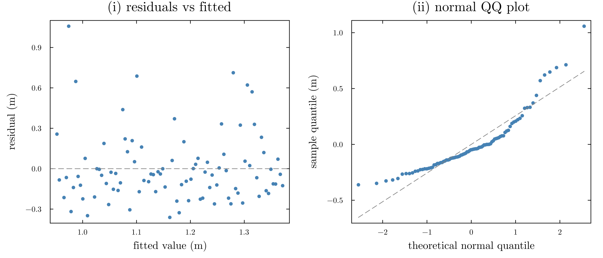

::: {.callout-important icon=false}
### Due: Thursday 18 February 2027, 9:00pm Eastern

Submit a PDF to Gradescope with **each sub-part tagged**. Untagged submissions lose 10%.

**20 points.** Problems 1 and 2 are pen-and-paper (14 points). Problem 3 is computational (6 points).
:::

## Problem 1 — The hinge (7 points)

A colleague fits a straight line to the Sewells Point annual maxima from Homework 1, regressing the
annual maximum $y_i$ (m) on years since 1928, $t_i$. Their software reports:

| | estimate | std. error |
|---|---|---|
| intercept $\hat\beta_0$ | 0.9523 | 0.0547 |
| slope $\hat\beta_1$ | 0.004363 | 0.000966 |

with $\hat\sigma = 0.2581$ m and $n = 92$.

**(a) (3 points)** Write out the Gaussian-error linear model in full, **including any and all
assumptions**. Distinguish clearly between what is assumed about the *errors* and what is assumed
about the *predictor*.

**(b) (2 points)** What does it mean to say that ordinary least squares **maximizes the Gaussian
likelihood**? Which assumption is that equivalence relying on? Show the step in the log-likelihood
where the assumption enters.

**(c) (2 points)** Why does adding a distributional assumption to least squares buy you anything at
all? **Name two things** you can do with the likelihood version that you cannot do with least squares
alone.

## Problem 2 — Short questions (7 points)

**(a) (3 points)** Suppose the errors were **Laplace** rather than Gaussian, with density
$$f(e) = \frac{1}{2b}\exp\!\left(-\frac{|e|}{b}\right).$$
What would the maximum-likelihood estimate of $(\beta_0, \beta_1)$ minimize instead of the sum of
squares? **Derive it from the likelihood** — do not simply assert the answer. In one sentence, say
what this implies about the influence of a single large outlier.

**(b) (2 points)** The two panels below are diagnostics for the fit in Problem 1.

{width=100%}

  i. Which assumption does **each** panel test?
  ii. Which panel shows a violation, and **what specifically in the plot** tells you?

**(c) (2 points)** The 95% confidence interval for $\beta_1$ is $(0.00244,\ 0.00628)$ m/yr. Mark each
statement **true** or **false**; correct the false ones in a phrase.

  i. There is a 95% probability that $\beta_1$ lies in this interval.
  ii. If the experiment were repeated many times, about 95% of such intervals would contain $\beta_1$.
  iii. The interval excludes zero, so the trend is real.
  iv. A wider interval would mean a larger estimated trend.

## Problem 3 — Recovery in miniature (6 points)

Use `data/annual_maxima.csv` (the output of Homework 1), keeping only years with at least 8,000 recorded
hours.

**(a) (2 points)** Fit the regression of annual maximum on years since 1928. Report $\hat\beta_1$ and
its standard error to sensible precision.

**(b) (3 points)** Now **simulate 200 datasets from the fitted model** at the observed $t_i$ — that
is, draw $y_i^{\ast} = \hat\beta_0 + \hat\beta_1 t_i + \varepsilon_i$ with
$\varepsilon_i \sim \text{Normal}(0, \hat\sigma^2)$ — and refit each one. Report the standard
deviation of $\hat\beta_1$ across the 200 refits.

**Show the comparison as a figure**, not a table of 200 numbers.

**(c) (1 point)** In one sentence: *should* (a) and (b) agree, and *do* they?
